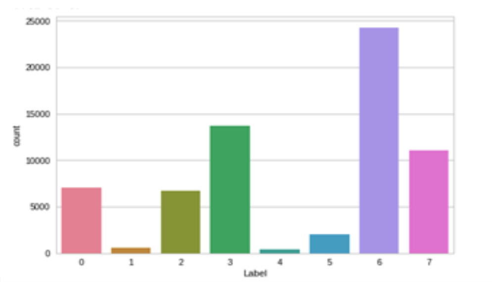

# Workplace-Behavior-Analysis-using-Text-Analysis

## Introduction
People spend 8-10 hours a day at their workplace and it is important for every organization to know what their employees do and how  they feel while at work. Organizations should decide how to maintain or manage the work environment of the organization. It shall help the organizations to decide the appraisal rate for their employees. We have used LSTM for text classification. The accuracy of LSTM is 88%.

## Dataset- wiki_data

1:"Activities",2:"Personal Information",3:"Compliment",4:"Relationship",
5:"Reframing",6:"Communicative Desensitization",7:"Isolation",0:"Approach"

## Conclusion
A neural network model has been trained which identifies the expressions and infers the emotions of the employee at work.
Can be used as a judgement tool and review tool by organizations to appreciate or criticize the employees.
Also it can be used to improve the work environment of the company.
